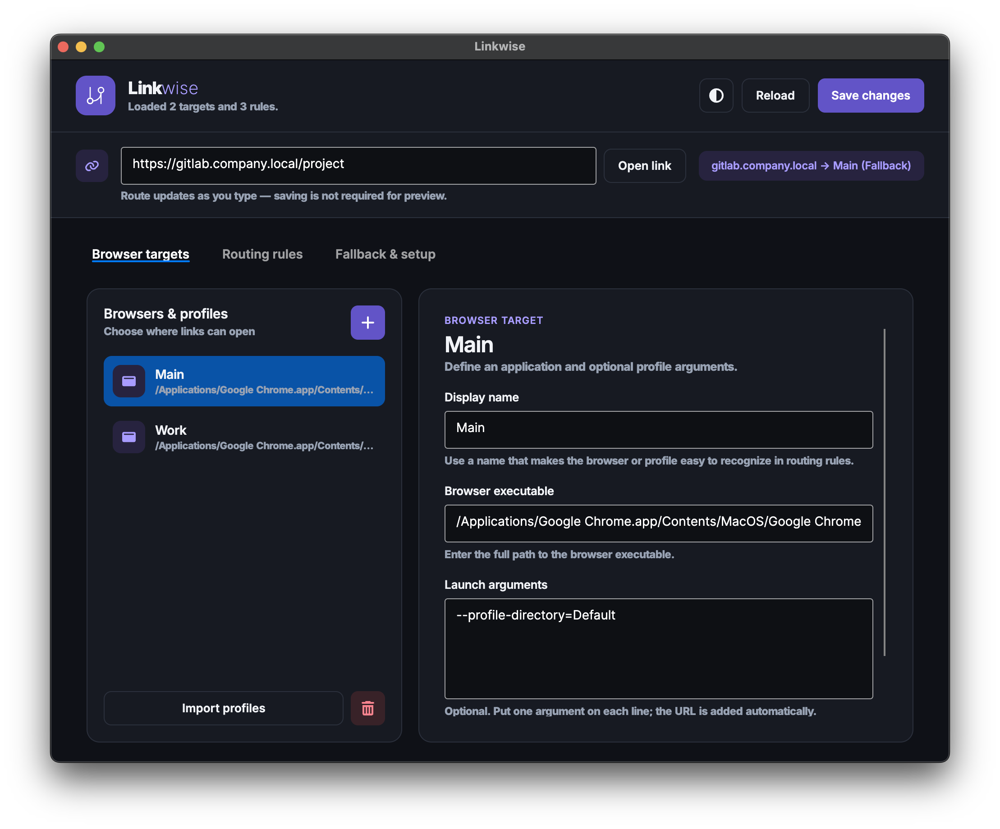

# <div align="center">

<div align="center"><b>Open every link in the right browser profile</b></div><br>

Desktop URL router and browser profile picker for Windows and macOS, built with .NET and Avalonia UI.

Linkwise routes web links to different browsers or browser profiles based on configurable URL rules.

For example:

* open company resources in a dedicated Chrome Work profile;
* open GitHub links in a development profile;
* route selected domains to Firefox;
* ask which browser profile to use when no rule matches;
* use a fallback browser for all remaining links.

Linkwise can register itself as the default HTTP and HTTPS handler on Windows and macOS.

> [!NOTE]
> Linkwise is currently under active development. Configuration formats and platform integration may change.

<div align="center">
  
</div>

## Features

* Cross-platform desktop application built with Avalonia UI
* URL routing by domain and configurable matching rules
* Multiple browser and browser-profile targets
* Browser profile auto-discovery
* Fallback browser configuration
* System tray integration
* HTTP and HTTPS default-handler registration
* Per-user Windows registration without administrator privileges
* Native macOS URL-handler integration

## Supported browsers

Linkwise can discover existing local profiles from:

* Google Chrome
* Chromium
* Mozilla Firefox
* Brave
* Vivaldi
* Opera
* Opera GX
* Yandex Browser

> [!NOTE]
> Microsoft Edge is not currently imported because it provides its own profile selection for links.

> [!IMPORTANT]
> The profile importer never creates targets automatically.
> A browser must be installed and contain at least one existing local profile before it can appear in the import window.

## Installation

Linkwise is currently intended to be built from source. Use the [Windows](#windows) or [macOS](#macos) packaging
instructions below to create a local application package.

For development without packaging, see [Development](#development).

## Configuration

On the first launch, Linkwise creates an empty configuration file in the platform-specific application data directory.

| Platform | Configuration path                                   |
|----------|------------------------------------------------------|
| macOS    | `~/Library/Application Support/Linkwise/config.json` |
| Windows  | `%APPDATA%\Linkwise\config.json`                     |

To add browser profiles:

1. Open the **Browser Targets** tab.
2. Select **Import profiles**.
3. Review the detected browsers and profiles.
4. Select the targets you want to add.
5. Save the configuration.

After browser targets have been configured, create URL rules and select a fallback target.

## Project structure

```text
src/
├── Linkwise.Core/
├── Linkwise.Desktop/
├── Linkwise.Platforms.Mac/
└── Linkwise.Platforms.Windows/
```

### `Linkwise.Core`

Platform-independent application logic:

* configuration models;
* JSON configuration storage;
* URL rule evaluation;
* incoming URL parsing;
* process-based browser launching.

### `Linkwise.Desktop`

Avalonia desktop application:

* settings interface;
* system tray icon and menu;
* configuration editing;
* browser-profile import;
* route preview;
* test URL launching.

### `Linkwise.Platforms.Mac`

macOS-specific integration:

* default-handler registration;
* native Swift helper;
* HTTP and HTTPS URL scheme handling.

### `Linkwise.Platforms.Windows`

Windows-specific integration:

* per-user URL-handler registration;
* Default Apps integration;
* HTTP and HTTPS protocol registration.

## Platform packaging

### macOS

Default-handler registration requires macOS 12 or later and a packaged `.app` bundle.

Build a bundle for the current Apple Silicon Mac:

```bash
./build/macos/package.sh
```

Build for an Intel Mac:

```bash
./build/macos/package.sh osx-x64
```

The resulting application bundle is written to:

```text
artifacts/macos/<rid>/Linkwise.app
```

After packaging:

1. Open `Linkwise.app`.
2. Configure and save a valid fallback browser target.
3. Open the **Fallback** tab.
4. Select **Use Linkwise for Web Links**.
5. Confirm the HTTP and HTTPS handler changes if requested by macOS.

The packaging script:

* publishes the Avalonia application;
* compiles the native `Linkwise.DefaultHandler` helper using `swiftc`;
* registers the HTTP and HTTPS schemes in `Info.plist`;
* applies an ad-hoc signature for local development.

A regular project build remains cross-platform and does not invoke Swift.

Incoming macOS open-URL events are handled through Avalonia's activatable lifetime.
Command-line URL invocation remains available for local development.

### Windows

The packaged Windows application requires the [.NET 10 Runtime](https://dotnet.microsoft.com/download/dotnet/10.0).

Build a framework-dependent Windows x64 package from PowerShell:

```powershell
.\build\windows\package.ps1
```

Build for Windows on ARM:

```powershell
.\build\windows\package.ps1 -RuntimeIdentifier win-arm64
```

The resulting application directory is written to:

```text
artifacts\windows\<rid>\Linkwise
```

Keep this directory at a stable location before registering Linkwise as a URL handler.

After packaging:

1. Run `Linkwise.Desktop.exe`.
2. Configure and save a valid fallback browser target.
3. Open the **Fallback** tab.
4. Select **Use Linkwise for Web Links**.
5. In Windows Default Apps, assign Linkwise to both HTTP and HTTPS.

Linkwise registers itself under `HKEY_CURRENT_USER`, so administrator privileges are not required.

Windows does not allow desktop applications to silently replace the user's HTTP and HTTPS handler selections. The final assignment must be confirmed through the Windows Settings application.

## Development
### Requirements

* [.NET 10 SDK](https://dotnet.microsoft.com/download/dotnet/10.0)
* Windows or macOS
* Xcode Command Line Tools when packaging for macOS

### Run from source

Open the settings window:

```bash
dotnet run --project src/Linkwise.Desktop/Linkwise.Desktop.csproj
```

Simulate an invocation from the operating system with a URL:

```bash
dotnet run \
  --project src/Linkwise.Desktop/Linkwise.Desktop.csproj \
  -- https://gitlab.company.local/project
```

### Build

Build the desktop application and its dependencies:

```bash
dotnet build src/Linkwise.Desktop/Linkwise.Desktop.csproj
```

## Roadmap
Potential future improvements include:
* Linux default-handler integration;
* signed distributable packages;
* import and export of routing configurations;
* automatic update support;
* localization.

## Contributing
Issues and pull requests are welcome.

When reporting a platform-integration problem, include:
* operating system and version;
* Linkwise version or commit;
* affected browser;
* browser installation type;
* relevant application logs.

## License
Linkwise is available under the [MIT License](LICENSE).

Third-party components and their licenses are listed in
[THIRD-PARTY-NOTICES.md](THIRD-PARTY-NOTICES.md).
